# TRUYỆN TRANH CẢNH BÁO LỪA ĐẢO TRỰC TUYẾN

**Đội thi:** AI_VENGERS  

---

## 📖 GIỚI THIỆU

Dự án này sử dụng công nghệ AI tiên tiến để tự động hóa quy trình sáng tạo truyện tranh, từ việc phát triển cốt truyện, thiết kế nhân vật, đến tạo hình ảnh cho từng khung hình. Chúng mình áp dụng quy trình **"AI thực hiện 90% - Con người review 10%"** để tạo ra một bộ truyện tranh hoàn chỉnh về chủ đề cảnh báo lừa đảo trực tuyến.

---

## 🎯 SẢN PHẨM

### Trang Bìa
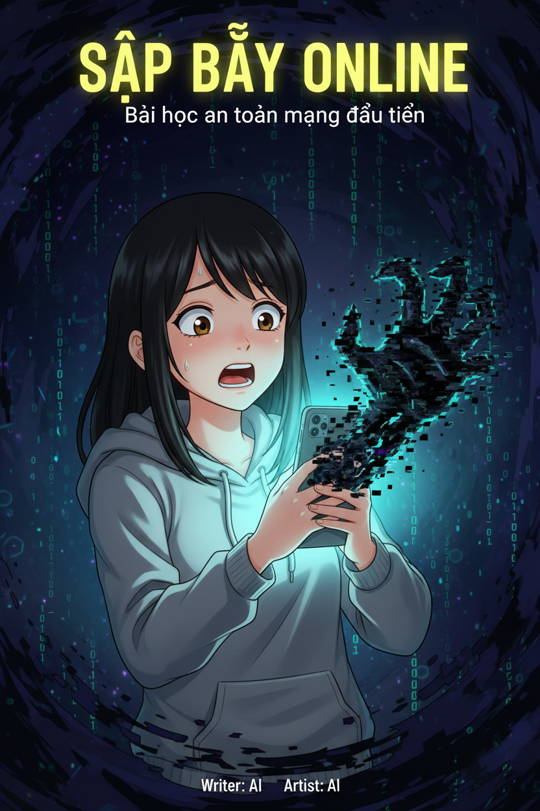

### Các Panel Được Generate

 Dưới đây là tất cả các panel trong thư mục `generated/final/`:

<table>
<tr>
<td width="33%">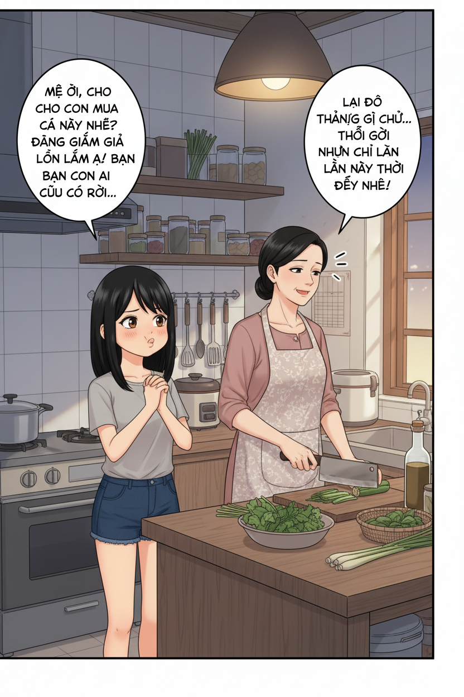<br/><sub>Panel 1</sub></td>
<td width="33%">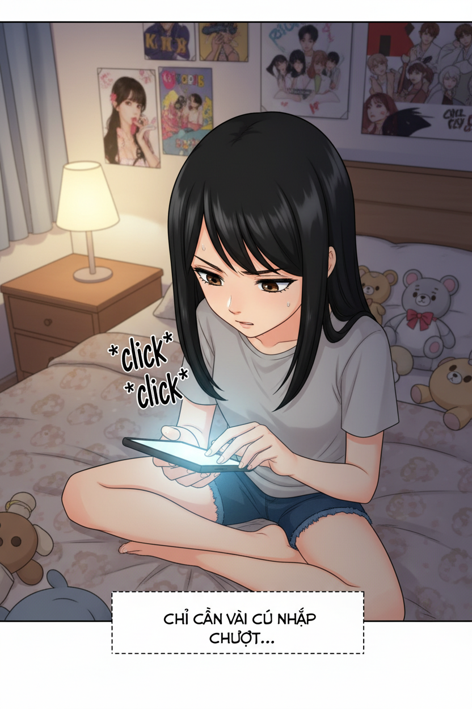<br/><sub>Panel 2</sub></td>
<td width="33%"><br/><sub>Panel 3</sub></td>
</tr>
<tr>
<td width="33%">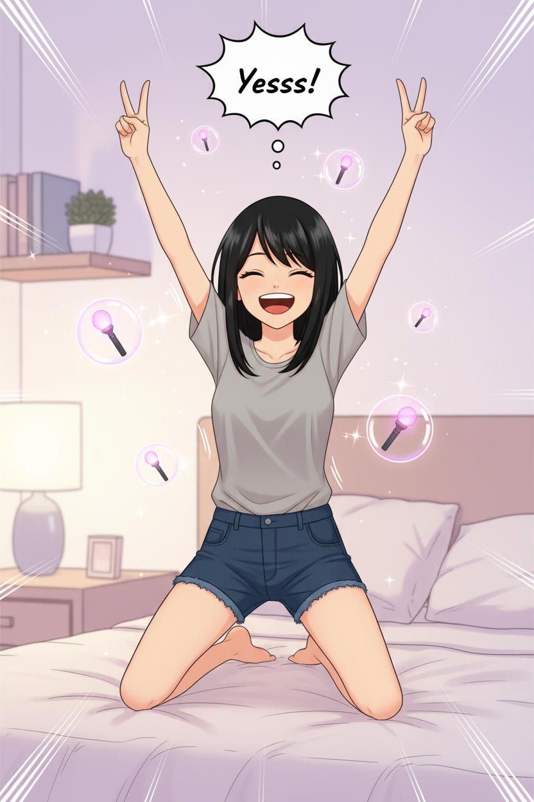<br/><sub>Panel 4</sub></td>
<td width="33%">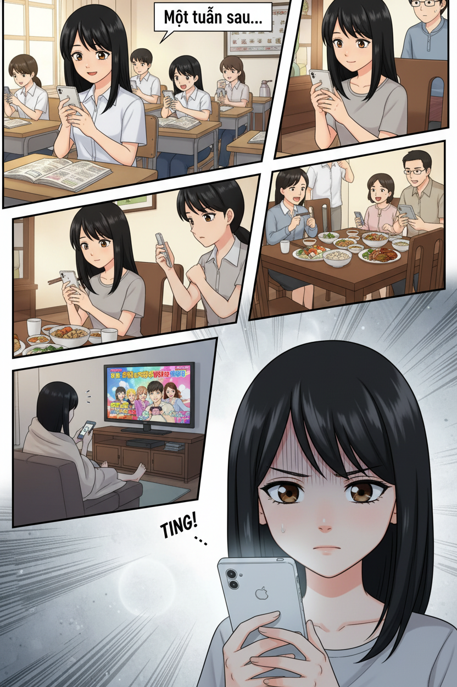<br/><sub>Panel 5</sub></td>
<td width="33%"><br/><sub>Panel 6</sub></td>
</tr>
<tr>
<td width="33%"><br/><sub>Panel 7</sub></td>
<td width="33%">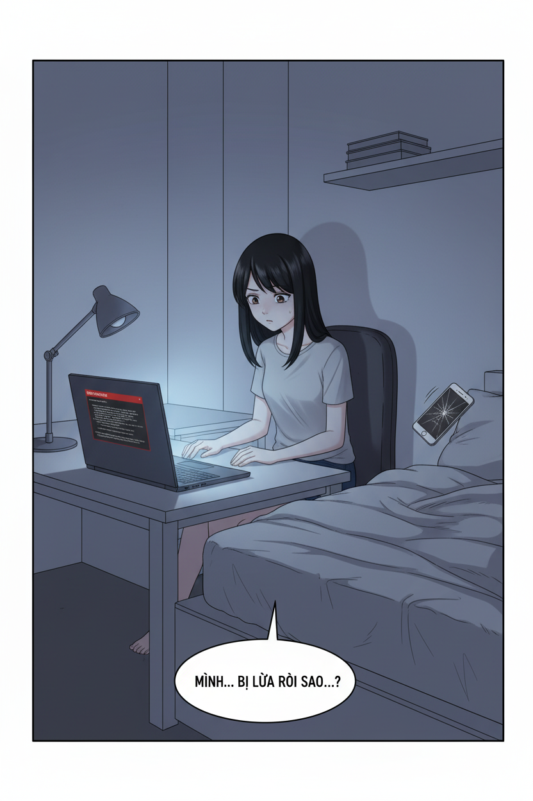<br/><sub>Panel 8</sub></td>
<td width="33%"><br/><sub>Panel 9</sub></td>
</tr>
<tr>
<td width="33%">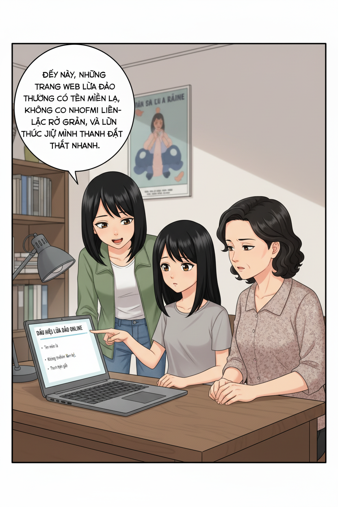<br/><sub>Panel 10</sub></td>
<td width="33%">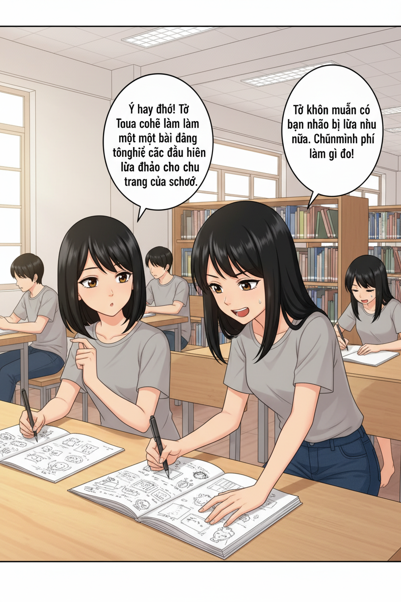<br/><sub>Panel 11</sub></td>
<td width="33%"><br/><sub>Panel 12</sub></td>
</tr>
<tr>
<td width="33%">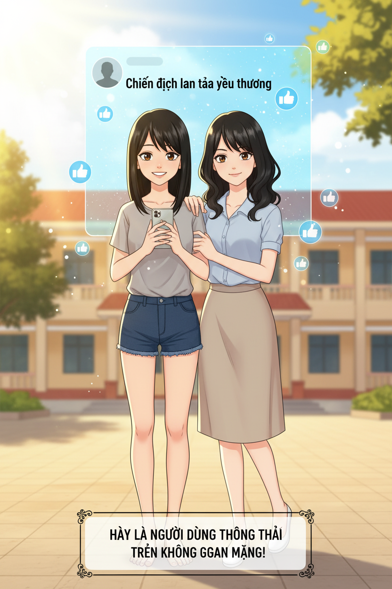<br/><sub>Panel 13</sub></td>
<td width="33%"></td>
<td width="33%"></td>
</tr>
</table>


---

## CHARACTER REFERENCE SHEETS

Chúng mình đã tạo các character reference sheets chi tiết cho nhân vật trong truyện. Đây là bước quan trọng để đảm bảo tính nhất quán về ngoại hình và phong cách nhân vật xuyên suốt các panels.

### Nhân Vật Chính

<table>
<tr>
<td width="50%" align="center">
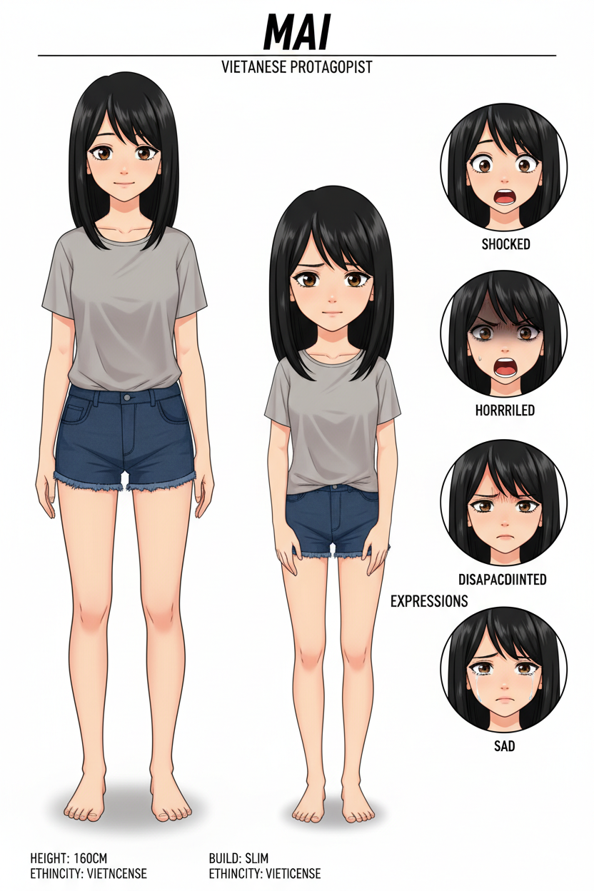
<br/><sub><b>Mai - 16 tuổi (Màu)</b></sub>
<br/><sub>Nữ sinh bị lừa đảo online</sub>
</td>
<td width="50%" align="center">
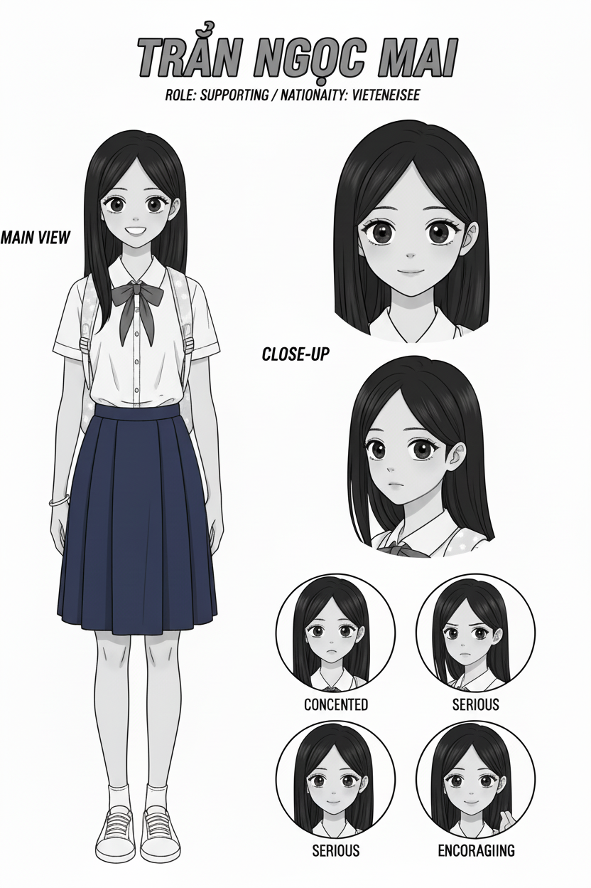
<br/><sub><b>Mai - 16 tuổi (Trắng đen) cho một kịch bản khác</b></sub>
<br/><sub>Version cho trang nội dung</sub>
</td>
</tr>
<tr>
<td width="50%" align="center">
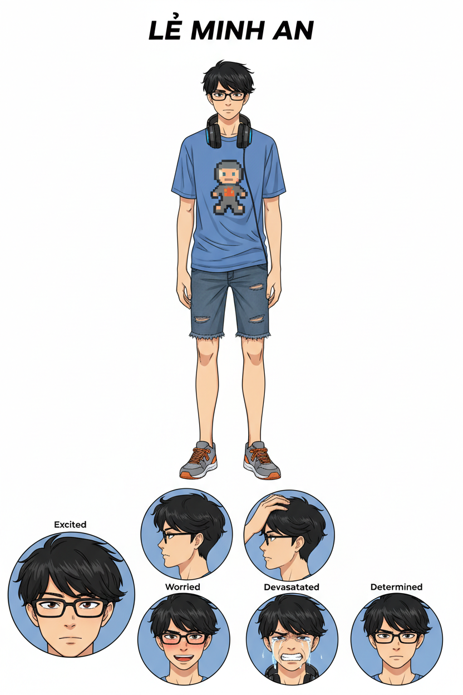
<br/><sub><b>An - Bạn thân của Mai (Màu)</b></sub>
<br/><sub>Vai trò hỗ trợ và động viên - cũng có tạo cho một kịch bản khác</sub>
</td>
<td width="50%" align="center">
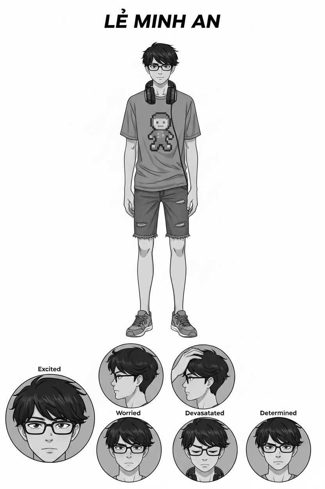
<br/><sub><b>An - Bạn thân của Mai (Trắng đen)</b></sub>
<br/><sub>Version cho trang nội dung - cũng có tạo cho một kịch bản khác</sub>
</td>
</tr>
</table>

**Ghi chú về Character Sheets:**
- ✅ Đã tạo được 3 nhân vật chính với cả version màu và trắng đen
- ✅ Character sheets bao gồm: full body view, facial expressions, style guide
- ⚠️ **Chưa tận dụng hết**: Do giới hạn thời gian, chúng mình chưa sử dụng hết tất cả character sheets đã tạo cũng như tạo các kịch bản khác nhau để so sánh.
- 🎯 **Potential**: Có thể tạo thêm nhiều nhân vật khác (Mẹ của Mai, các bạn học, v.v.) và sử dụng trong phiên bản mở rộng

**Lợi ích của Character Reference Sheets:**
1. **Consistency**: Đảm bảo nhân vật giống nhau trong mọi panel
2. **Reusability**: Có thể tái sử dụng cho nhiều scenes khác nhau
3. **Scalability**: Dễ dàng mở rộng cast nhân vật khi cần
4. **Quality Control**: Giảm thiểu sai lệch về ngoại hình khi AI generate

---

## �🚀 QUY TRÌNH SÁNG TẠO TỰ ĐỘNG VỚI AI

### Tổng Quan Pipeline

```
INPUT (Đề bài + Yêu cầu)
    ↓
[BƯỚC 1] PHÁT TRIỂN CÂU CHUYỆN
    → AI Gemini 2.5 Pro
    → Tạo: Story Bible, JSON Master Prompt
    ✓ Review
    ↓
[BƯỚC 2] THIẾT KẾ NHÂN VẬT
    → AI Gemini 2.5 Flash Image
    → Tạo: Character Reference Sheets (Mai - 16 tuổi)
    → Output: Reusable character references
    ✓ Review
    ↓
[BƯỚC 3] TẠO PROMPTS & HÌNH ẢNH
    → AI Gemini Pro + Flash
    → Tạo: 20+ panel prompts đầy đủ
    → Tạo: 20+ images sử dụng character references
    ✓ Review VN text
    ↓
[BƯỚC 4] HẬU KỲ XỬ LÝ
    → AUTOMATION Pipeline
    → Chuyển đổi: A4 format, B&W, Text fix
    ⚠️ Bottleneck: Manual text editing required
    🔧 Manual Fix
    ↓
OUTPUT (Comic hoàn chỉnh)
```

### Phân Bổ Công Việc
- **90% AI tự động:** Tạo story, character, panel prompts, và images
- **10% Con người review:** Quality control & manual fixes
- **✅ Scalable:** Quy trình consistent, có thể mở rộng
- **⚠️ Bước 4:** Cần manual do technical limitations

---

## 💡 4 ĐIỂM ĐỔI MỚI SÁNG TẠO TRONG MASTER PROMPT

### 1. 📦 **Nested Prompts System** (Hệ thống Lệnh Lồng Nhau)

**Khái niệm "Prompt-trong-Prompt":**
- Nhân vật: `reference_prompt` được nhúng trong JSON
- Khung hình: `panel_prompt` được nhúng cho mỗi panel
- Bìa: `cover_prompt` được nhúng riêng biệt

**Lợi ích:**
→ **1 mẫu master = 100+ prompt chi tiết tự động sinh ra**

### 2. 🔗 **Cross-Page Continuity** (Tính Liên Tục Xuyên Trang)

**Tham chiếu thông minh giữa các khung hình:**
- Khung hình 1: `references_needed: []` (không cần tham chiếu)
- Khung hình 2: `references_needed: ["Previous: Panel 1"]`
- Trang 2: `references_needed: ["Previous: Last panel Page 1"]`

**Lợi ích:**
→ Luồng câu chuyện tự nhiên, chuyển cảnh mượt mà, duy trì consistency

### 3. 🛡️ **Multi-Layer Safety** (Kiểm Soát Văn Hóa Đa Lớp)

**Tích hợp kiểm soát văn hóa ở nhiều cấp độ:**
- Đặc điểm ngoại hình: màu da, hình dáng mắt, nét mặt Việt Nam
- Yếu tố văn hóa: bối cảnh, trang phục, phụ kiện phù hợp
- Ép buộc tuân thủ: yêu cầu cốt lõi được **lặp lại 5+ lần mỗi prompt**

**Lợi ích:**
→ Đảm bảo tính chân thực văn hóa Việt Nam trong mọi khung hình

### 4. 🎬 **Cinematic Control** (Kiểm Soát Dàn Dựng & Ống Kính)

**Thông số kỹ thuật chi tiết cho mỗi khung hình:**
- **Camera:** góc máy, cự ly, phối cảnh (eye-level, high-angle, close-up...)
- **Ánh sáng:** nguồn sáng, bảng màu, tâm trạng (dramatic, warm, cold...)
- **Văn bản:** 3 loại với metadata (speech balloon, caption box, sound effects)
- **Mô tả:** 20-30 dòng chi tiết cho mỗi prompt

**Lợi ích:**
→ Kiểm soát hoàn toàn cảm xúc và cách kể chuyện như đạo diễn phim

---

## 🛠️ CẤU TRÚC DỰ ÁN

### Các File Chính

#### 1. **Master Prompt Template** 
📄 `prompt_json.txt`
- Template JSON structured với 4 đổi mới sáng tạo
- Hướng dẫn Gemini 2.5 Pro tạo story bible hoàn chỉnh
- Bao gồm: comic_info, story_overview, characters, cover, pages

**Cấu trúc JSON Master Prompt:**
```json
{
  "comic_info": { /* Metadata về truyện */ },
  "story_overview": { /* Theme, setting, summary, cultural elements */ },
  "characters": [
    {
      "id": 1,
      "name": "Mai",
      "physical_appearance": { /* Chi tiết ngoại hình */ },
      "clothing": { /* Trang phục */ },
      "reference_prompt": {
        "prompt": "Create a detailed character reference sheet..."
      }
    }
  ],
  "cover": {
    "cover_prompt": { /* Nested prompt cho bìa */ }
  },
  "pages": [
    {
      "page_number": 1,
      "panels": [
        {
          "panel_number": 1,
          "camera": { /* Góc máy, cự ly, phối cảnh */ },
          "lighting": { /* Nguồn sáng, màu sắc, tâm trạng */ },
          "text_elements": { /* Dialogues, captions, sound effects */ },
          "panel_prompt": {
            "references_needed": ["Character reference", "Previous panel"],
            "prompt": "Create a Modern Manga style comic panel..."
          }
        }
      ]
    }
  ]
}
```

#### 2. **Image Generation Core**
📄 `image_client.py`
- Client class cho Gemini 2.5 Flash Image API
- Hỗ trợ:
  - Text-to-Image generation
  - Image-to-Image với reference images
  - Multi-image fusion (tối đa 3 reference)
  - Session management cho character consistency
  - 10 aspect ratios khác nhau

#### 3. **Configuration**
📄 `config.py`
- Cài đặt API endpoints
- Aspect ratios được hỗ trợ
- Image generation parameters
- Output directory structure

#### 4. **Generation Script**
📄 `test_generation_with_reference.py`
- Script tự động tạo comic panels
- Sử dụng character reference sheets
- Tích hợp với master prompt output
- Tự động save và organize outputs

### Thư Mục Output
📁 `generated/`
- `generated/final/` - Sản phẩm cuối cùng
  - `cover_1.png` - Trang bìa màu
  - `generated_YYYYMMDD_HHMMSS.png` - 13 panels được generate với timestamp
- `generated/20251025/` - Character reference sheets và test outputs

### Ví Dụ JSON Output

#### 📄 `page1.json` - Trang 1: "404 - Hy Vọng Không Tìm Thấy"
```json
{
  "page_number": 1,
  "page_title": "404 - Hy Vọng Không Tìm Thấy",
  "page_summary": "Mai ngồi một mình trong bóng tối, đối mặt với màn hình máy tính hiển thị lỗi 404...",
  "panels": [
    {
      "panel_number": 1,
      "scene_description": "Trong căn phòng ngủ tối, Mai ngồi chết lặng trước màn hình laptop...",
      "camera": {
        "angle": "Medium close-up",
        "perspective": "Slightly high angle"
      },
      "lighting": {
        "source": "Chỉ có ánh sáng lạnh, vô cảm từ màn hình laptop",
        "color_palette": "Gam màu xanh xám, thiếu sức sống",
        "overall_feeling": "Sự sụp đổ và nhận ra sự thật đau lòng"
      },
      "text_elements": {
        "captions": [
          {
            "text": "Mình... bị lừa rồi sao...?",
            "type": "Internal monologue",
            "position": "Góc dưới cùng của khung hình"
          }
        ]
      },
      "panel_prompt": {
        "references_needed": ["Character Mai reference image"],
        "prompt": "Create a single, highly dramatic comic book panel in a Modern Manga style...\n\nCHARACTER:\nMai (Vietnamese):\n- Use the uploaded character reference.\n- Expression: A look of utter shock, disbelief, and dawning horror...\n\nSETTING/BACKGROUND:\n- Her bedroom is dark and filled with shadows. K-pop posters on the wall...\n- Visual effect: Faint, glitchy, holographic images of the K-pop lightstick..."
      }
    }
  ]
}
```

#### 📄 `page25.json` - Trang 2-5: Cross-Page Continuity
**Trang 2, Panel 2** - Ví dụ về tham chiếu panel trước:
```json
{
  "panel_number": 2,
  "scene_description": "Cận cảnh Mai đang ngồi trong phòng ngủ, nhập thông tin thẻ thanh toán...",
  "text_elements": {
    "captions": [
      {
        "text": "Chỉ cần vài cú nhấp chuột...",
        "type": "Internal thought"
      }
    ],
    "sound_effects": [
      {
        "text": "*click* *click*",
        "position": "near her fingers"
      }
    ]
  },
  "panel_prompt": {
    "references_needed": ["Mai reference", "Previous panel: Page 2, Panel 1"],
    "prompt": "Create a Modern Manga style comic panel. Aspect ratio: 2:3...\n\nCHARACTERS:\n- Mai (Vietnamese): Use uploaded reference. Her expression is concentrated and a little anxious..."
  }
}
```

**Trang 3, Panel 1** - Ví dụ về tham chiếu cross-page:
```json
{
  "panel_number": 1,
  "scene_description": "Một chuỗi các khung hình nhỏ chồng lên nhau, thể hiện thời gian trôi qua...",
  "panel_prompt": {
    "references_needed": ["Mai reference", "Previous panel: Page 2, Panel 4"],
    "prompt": "Create a Modern Manga style comic panel. Aspect ratio: 2:3...\n\nCAMERA: Montage of small, overlapping frames showing the passage of time..."
  }
}
```

**Trang 5, Panel 3** - Kết thúc với thông điệp giáo dục:
```json
{
  "panel_number": 3,
  "scene_description": "Cảnh cuối cùng. Mai và An đứng cạnh nhau, nhìn vào điện thoại với nụ cười tự tin...",
  "text_elements": {
    "captions": [
      {
        "text": "Và đôi khi, bài học đắt giá nhất lại trở thành món quà quý giá nhất - nếu chúng ta biết chia sẻ.",
        "type": "Closing narration"
      }
    ]
  }
}
```

---

## 🔧 CÔNG NGHỆ SỬ DỤNG

### AI Models
- **Gemini 2.5 Pro:** Tạo story, dialogue, master prompts
- **Gemini 2.5 Flash Image:** Generate character references và comic panels

### Technical Stack
- **Python 3.10+**
- **Google Generative AI API**
- **Requests** cho API calls
- **PIL/Pillow** cho image processing
- **Base64 encoding** cho image data

### Key Features
- ✅ Character reference với style consistency
- ✅ Multi-image reference support (tối đa 3 ảnh)
- ✅ Session management cho context preservation
- ✅ Aspect ratio flexibility (10 tỷ lệ)
- ✅ Automated file organization

---


## ⚠️ LƯU Ý VỀ SẢN PHẨM NỘP

Do giới hạn về các bước chuẩn bị và một số vấn đề về technical, sản phẩm hiện tại **chưa đáp ứng đầy đủ** một số yêu cầu của ban tổ chức:

### Các Điểm Chưa Hoàn Thiện

#### 1. ❌ **Chữ Tiếng Việt trong Truyện**
- **Vấn đề:** AI image generation hiện tại chưa render chính xác chữ Việt có dấu
- **Trạng thái:** Các speech balloons, captions, và sound effects cần chỉnh sửa thủ công
- **Giải pháp đề xuất:** Cần bước post-processing với typography tools bằng phần mềm chỉnh sửa ảnh thông thường

#### 2. ❌ **Màu Sắc Trang Nội Dung**
- **Yêu cầu:** Các trang nội dung (trừ bìa) phải là trắng đen
- **Trạng thái:** Hiện tại các trang vẫn giữ màu full color
- **Giải pháp đề xuất:** Cần pipeline automation để convert sang B&W với proper contrast, có thêm thời gian sẽ chạy lại prompt tạo ảnh trắng đen với ảnh nhân vật cũng được chuyển sang trắng đen

#### 3. ❌ **Layout Khung Hình**
- **Yêu cầu:** Mỗi trang cần chia thành nhiều panel (khung hình) rõ ràng
- **Trạng thái:** Mỗi panel hiện đang được generate như một image độc lập
- **Giải pháp đề xuất:** Cần compositing tool để ghép panels thành trang hoàn chỉnh 


## 🎓 GIÁ TRỊ GIÁO DỤC

### Cốt Truyện: "Sập Bẫy Online"

**Tóm tắt 5 trang:**

1. **Trang 1 - "404 - Hy Vọng Không Tìm Thấy"**  
   Mai phát hiện website đã biến mất, nhận ra mình bị lừa đảo. Khoảnh khắc đau đớn của sự thật.

2. **Trang 2 - "Cú Nhấp Chuột Vội Vã"**  
   Flashback: Mai thuyết phục mẹ, háo hức nhập thông tin thanh toán để mua lightstick K-pop giảm giá.

3. **Trang 3 - "Sự Im Lặng Đáng Sợ"**  
   Một tuần trôi qua không có hàng. Mai kiểm tra và thấy thông báo "404 Not Found" - website đã biến mất.

4. **Trang 4 - "Bài Học Đắt Giá"**  
   Mẹ và bạn thân An an ủi Mai. Cả ba cùng tìm hiểu về dấu hiệu lừa đảo online.

5. **Trang 5 - "Chia Sẻ Để Bảo Vệ"**  
   Mai và An tạo bài đăng cảnh báo cho học sinh khác, biến nỗi đau thành bài học ý nghĩa.

### Nội Dung Truyện
Câu chuyện của Mai - nữ sinh 16 tuổi - người bị lừa đảo khi mua lightstick K-pop online:
- ✅ Phù hợp tâm lý học sinh THCS & THPT
- ✅ Tình huống thực tế, dễ đồng cảm
- ✅ Thông điệp rõ ràng về cách phòng tránh lừa đảo
- ✅ Bối cảnh văn hóa Việt Nam chân thực

### Thông Điệp Cốt Lõi
1. **Nhận biết dấu hiệu lừa đảo:** Giá quá rẻ, website không uy tín
2. **Cảnh giác với thông tin cá nhân:** Không chia sẻ thông tin thanh toán bừa bãi
3. **Xác minh nguồn:** Kiểm tra review, hỏi ý kiến người lớn
4. **Hậu quả:** Mất tiền, mất niềm tin, ảnh hưởng tâm lý
5. **Biến bài học thành hành động:** Chia sẻ kinh nghiệm để bảo vệ người khác

### Kỹ Thuật Kể Chuyện

**Cấu trúc phi tuyến tính:**
- Trang 1 mở đầu bằng climax (khoảnh khắc phát hiện lừa đảo)
- Trang 2 flashback về quá trình bị lừa
- Trang 3-5 tiếp tục theo timeline forward

**Emotional Journey:**
```
Trang 1: Shock & Devastation (climax)
         ↓
Trang 2: Hope & Excitement (flashback - trước khi bị lừa)
         ↓
Trang 3: Anxiety → Realization (khám phá sự thật)
         ↓
Trang 4: Comfort → Learning (được hỗ trợ, học hỏi)
         ↓
Trang 5: Empowerment → Action (trao quyền, hành động)
```

---

## 🔮 TƯƠNG LAI & MỞ RỘNG

### Khả Năng Scale
Quy trình này có thể:
- 📈 Tạo hàng trăm comic với chủ đề khác nhau
- 🌍 Adapt cho các văn hóa và ngôn ngữ khác
- ⚡ Giảm thời gian sản xuất từ tuần → giờ
- 💰 Giảm chi phí sản xuất đáng kể

### Cải Tiến Cần Thiết
1. **Text Rendering:** Tích hợp OCR + typography engine cho Vietnamese
2. **Auto Layout:** Tool tự động compose panels thành trang
3. **Color Processing:** Pipeline tự động B&W conversion với quality control
4. **Quality Control:** Automated validation cho cultural accuracy

---

## 👥 TEAM AI_VENGERS

Chúng mình tin rằng **AI là công cụ khuếch đại sáng tạo**, không phải thay thế. Quy trình "AI 90% - Human 10%" cho phép:
- ⚡ Tốc độ sản xuất nhanh
- 🎨 Giải phóng sáng tạo cho storytelling
- 🎯 Tập trung vào message và quality control
- 📚 Khả năng tạo nhiều phiên bản để test

---

## 📞 LIÊN HỆ

**Team:** AI_VENGERS  

---

